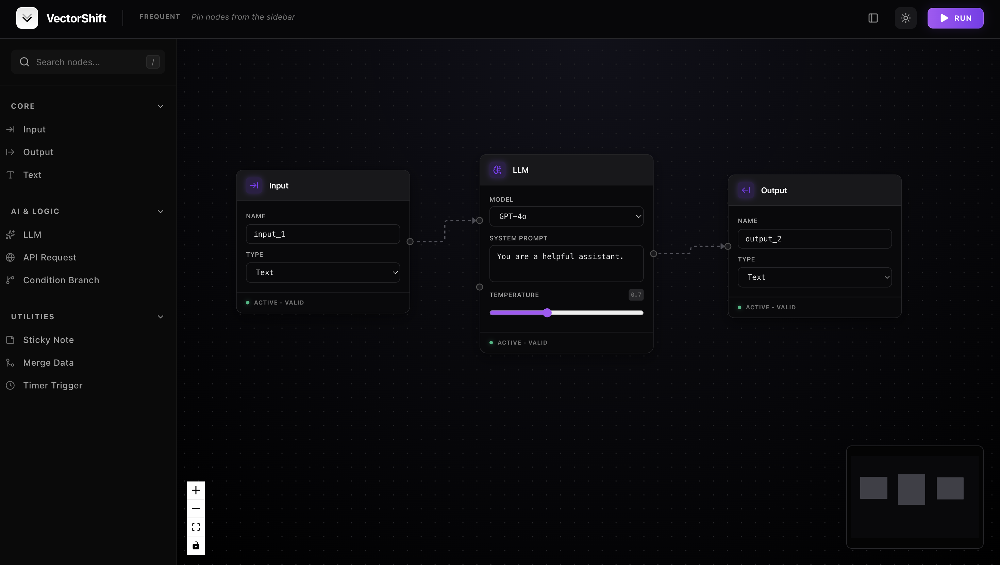
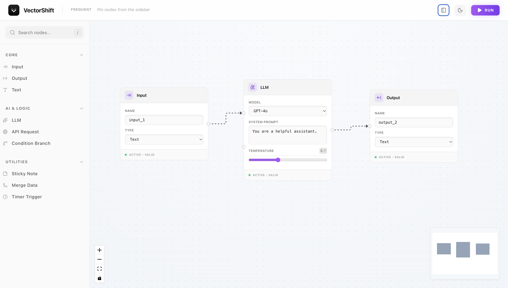

<div align="center">
  <h1>⚡ VectorShift</h1>
  <p><strong>A full-stack visual programming platform for designing and executing AI pipelines.</strong></p>
  <p>Built with React Flow, FastAPI, Pydantic, and Gemini AI</p>
  
  <p>
    
    
    
    
    
  </p>
</div>

---

## 🤔 What is VectorShift?

VectorShift is a highly interactive, node-based workspace that allows developers and prompt engineers to design complex AI workflows visually. Instead of writing heavy boilerplate code to chain prompts and APIs, VectorShift lets you literally draw your logic on a canvas.

When you execute a pipeline, the system doesn't just blindly run the nodes. A robust Python engine mathematically validates your graph to prevent infinite loops, determines the exact execution order, and securely orchestrates real-time calls to Google's Gemini AI.

### 🗺️ Documentation & Architecture
I spent a lot of time structuring this project to be clean, decoupled, and maintainable. You can check out how the system works under the hood here:
- 📊 **[Flowcharts & Data Flow](docs/DATA_FLOW.md)** - See exactly how data moves from the visual canvas to the LLM execution engine.
- 🏗️ **[Architecture Overview](docs/ARCHITECTURE.md)** - How I cleanly separated the React UI, the Zustand state management, and the FastAPI engine.

---

## 🌟 Showcase & Pipelines Built with VectorShift

Here is a look at the professional-grade interface and what it is capable of building.

### 1. Dark Mode Pipeline Builder
A sleek, distraction-free environment for building complex LLM chains and logic gates.
<p align="center">
  
</p>

### 2. Light Mode Pipeline Builder
A crisp, high-contrast theme optimized for readability during daytime coding and prompt design.
<p align="center">
  
</p>

---

## 🚀 Key Features

- **Pixel-Perfect Canvas:** A highly responsive workflow builder powered by React Flow and Tailwind CSS.
- **Native AI Integration:** Built-in LLM nodes fully integrated with Google's Gemini, featuring dynamic prompt templating (`{{variables}}`) and live temperature controls.
- **Ironclad Execution Engine:** A robust FastAPI backend that strictly validates your pipeline (using Kahn's algorithm for DAG validation) before any API calls are made.
- **Dynamic Smart Nodes:** Nodes automatically adapt to your logic. Input and Output nodes define strict schema boundaries for your pipeline.

## ⚙️ Local Development Setup

1. **Clone the repo**
   ```bash
   git clone https://github.com/irajatsharma-10/vectorShift.git
   cd vectorShift
   ```

2. **Backend Setup**
   Navigate to the `backend` directory and set up the Python environment:
   ```bash
   cd backend
   python -m venv .venv
   source .venv/bin/activate
   pip install fastapi uvicorn python-multipart pydantic pydantic-settings openai
   ```

3. **Environment Variables**
   Create a `.env` file in the `backend` directory and add your Google Gemini API key:
   ```env
   GEMINI_API_KEY=your_api_key_here
   ```

4. **Run the Backend**
   ```bash
   uvicorn main:app --reload --port 8000
   ```

5. **Frontend Setup & Run**
   Open a new terminal, navigate to the `frontend` directory:
   ```bash
   cd frontend
   npm install
   npm start
   ```
   The visual builder will instantly launch at `http://localhost:3000`.
